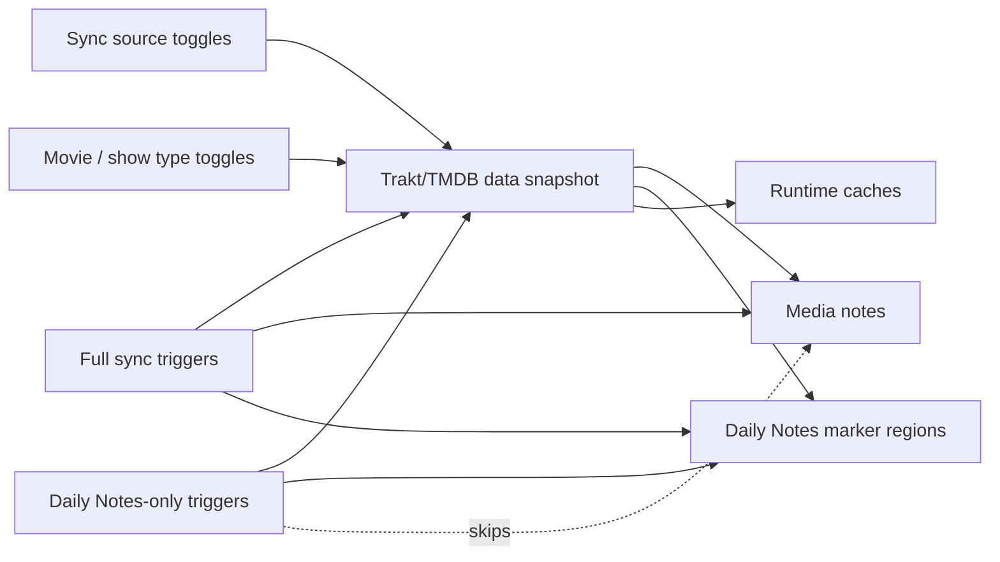
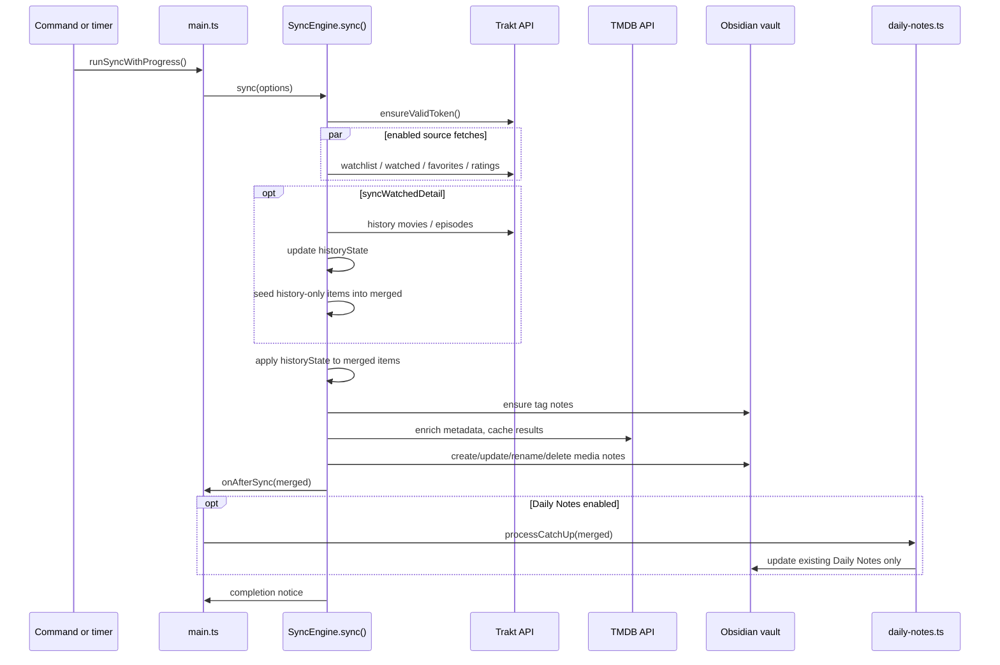
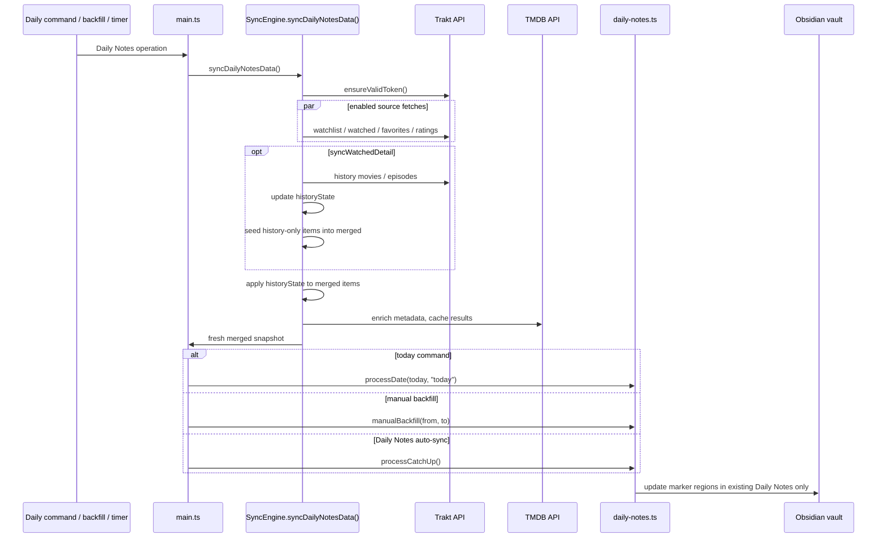
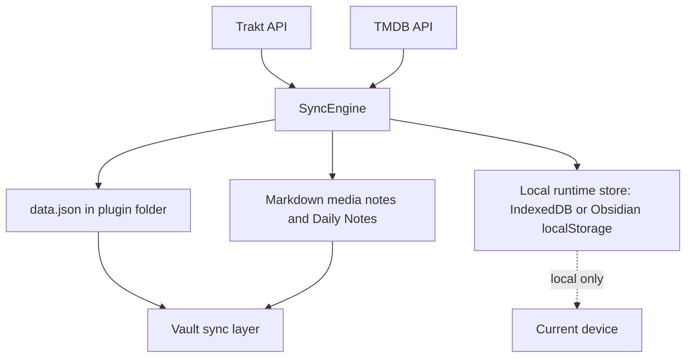

# Sync Architecture And Control Matrix

This document is the source of truth for what every sync control does.
Use it when changing sync sources, full sync, Daily Notes sync, auto-sync,
or backfill behavior.

## Control Groups

The plugin has three different groups of controls. They overlap, but they
do not mean the same thing.

- **Sync source toggles** decide which Trakt collections are fetched:
  watchlist, favorites, watched, detailed watch history, ratings.
- **Sync behavior toggles** decide when a full media-note sync runs and
  whether movies or shows are included.
- **Daily Notes controls** decide whether existing Daily Note files get
  event lines, and whether they run on a separate timer without touching
  media notes.

All paths share the same `SyncEngine.syncing` lock. If a full sync and a
Daily Notes-only sync collide, the first run owns the lock and the later
run exits.

## Source Toggle Matrix

These toggles live in **Settings -> Sync -> Sync sources**.

| Toggle | Default | Type gate | Trakt endpoints | Adds to `merged` | Media note effect | Daily Note event |
|---|---:|---|---|---|---|---|
| Sync watchlist | on | `syncMovies`, `syncShows` | `/sync/watchlist/movies`, `/sync/watchlist/shows` | `watchlist`, `watchlist_added_at` | Creates or updates notes for items currently on the watchlist | `added_to_watchlist` on `listed_at` date |
| Sync favorites | on | `syncMovies`, `syncShows` | `/sync/favorites/movies`, `/sync/favorites/shows` | `favorite`, `favorited_at` | Creates or updates notes for favorited items | `favorited` on `listed_at` date |
| Sync watch history | off | `syncMovies`, `syncShows` | `/sync/watched/movies`, `/sync/watched/shows` | `watched`, `plays`, `last_watched_at`, `episodes_watched` | Creates or updates notes for watched items | No per-day event by itself |
| Sync watch history (detailed) | off | Requires Sync watch history and type gate | `/sync/history/movies`, `/sync/history/episodes` | `watch_history_movie`, `watch_history_episodes`; can seed history-only items into `merged` | Adds detailed watch-history body sections and can create notes for history-only items | `watched` events on every `watched_at` timestamp |
| Sync ratings | off | `syncMovies`, `syncShows` | `/sync/ratings/movies`, `/sync/ratings/shows` | `my_rating`, `rated_at` | Creates or updates notes for rated items | `rated` on `rated_at` date |

Important boundaries:

- `syncMovies=false` means no movie endpoints are called, even if a source
  toggle is on.
- `syncShows=false` means no show endpoints are called, even if a source
  toggle is on.
- Detailed watch history is event-level data. It updates `historyState`
  first, then hydrates matching `NormalizedItem`s. If a history event
  contains a show or movie that was not returned by watched/watchlist/
  favorites/ratings, the sync must seed that item into `merged` so media
  notes and Daily Notes can see it.
- If older local runtime state already contains history entries for items
  missing from `merged`, an incremental history fetch may not return those
  old events again. The engine detects that orphaned state and performs one
  repair full history refresh so it can recover the missing media metadata.
- Daily Notes watched rows require **Sync watch history (detailed)**.
  The plain watched source only has aggregate `last_watched_at`, not every
  watch event needed for a Daily Note date.

## Full Sync Triggers

Full sync means `SyncEngine.sync()` followed by media-note reconciliation.

| Control | Location | Runs when | Writes media notes | Writes Daily Notes | Uses source toggles |
|---|---|---|---:|---:|---:|
| Sync command | Command palette | User runs `Sync Trakt` | yes | yes, if Daily Notes enabled | yes |
| Sync on startup | Settings -> Sync | Obsidian loads, after a 5 second delay | yes | yes, if Daily Notes enabled | yes |
| Auto-sync | Settings -> Sync | Every configured interval | yes | yes, if Daily Notes enabled | yes |
| Force full watch-history refresh | Command palette | User runs command | yes | yes, if Daily Notes enabled | yes, with detailed history forced full |

Full sync sequence:

Full sync writes media notes. Depending on settings, it can also:

- create missing media notes
- update frontmatter
- replace managed body sections
- rename files after metadata/title changes
- trash notes no longer present in any enabled source when
  `deleteRemovedItems=true`
- update Daily Notes after media-note work if Daily Notes are enabled

## Daily Notes-only Triggers

Daily Notes-only sync means `SyncEngine.syncDailyNotesData()` followed by
Daily Note marker writes. It refreshes the same Trakt/TMDB data needed by
Daily Notes, but skips media-note reconciliation.

| Control | Location | Runs when | Writes media notes | Writes Daily Notes | Uses source toggles |
|---|---|---|---:|---:|---:|
| Sync to Daily Notes today | Command palette | User runs command | no | today only | yes |
| Manual backfill | Settings -> Daily Notes | User confirms date range | no | selected existing Daily Notes | yes |
| Daily Notes-only auto-sync | Settings -> Daily Notes | Every configured interval | no | today plus catch-up window | yes |

Daily Notes-only sequence:

Daily Notes-only sync deliberately does not call:

- `ensureTagNotes`
- media-note folder creation
- media-note scan
- media-note create/update/delete
- filename rename
- full note body rewrite

## Daily Notes Write Policies

Daily Notes integration never creates missing Daily Note files. It only
updates files that already exist and only touches the configured marker
region.

| Operation | Date range | Data refresh first | Missing file | Existing non-empty marker | Empty marker | No marker |
|---|---|---:|---|---|---|---|
| Full sync catch-up | today + cursor gap | shares full sync data | skip | today replaces, past skips | fill | append marker block |
| Daily Notes-only auto-sync | today + cursor gap | yes | skip | today replaces, past skips | fill | append marker block |
| Today command | today only | yes | skip | replace or incremental append, depending on Today write mode | fill | append marker block |
| Manual backfill | selected range | yes | skip | today follows Today write mode, past skips | fill | append marker block |

Today write mode:

- **Default** replaces today's marker region with the latest rendered
  events. This reflects source-side edits such as changed ratings or
  deleted scrobbles after a full history refresh.
- **Incremental** appends new event lines and preserves manual notes inside
  the marker region. It does not remove stale lines.

## Storage And Backend Boundaries

The plugin has no remote backend of its own. Its backend surfaces are:

| Layer | Stored data | Sync behavior |
|---|---|---|
| Vault-synced `data.json` | settings, auth, source toggles, templates, small coordination fields | syncs through the user's vault sync tool |
| Markdown notes | media notes, tag notes, Daily Notes marker content | syncs through the user's vault sync tool |
| Local runtime store | large TMDB cache, large detailed-history aggregates, known event ids, local history cursors | device-local, rebuildable |
| Trakt API | source collections and watch events | fetched on demand |
| TMDB API | poster and localized metadata | fetched on cache miss or stale cache |

The cross-device detailed-history guard is
`historyState.lastAuthoritativeFullRefreshAt`. When one device completes a
full detailed-history refresh, another device with an older local runtime
history cache must full-refresh before writing detailed history from stale
local state.

## Code Entry Points

| Concern | File | Entry point |
|---|---|---|
| Full sync command and timer | `src/main.ts` | `runSyncWithProgress()` |
| Daily Notes command, backfill, and timer | `src/main.ts` | `refreshDailyNotesDataSnapshotWithProgress()`, `runDailyNotesSyncWithProgress()` |
| Full source fetch and media-note reconciliation | `src/sync-engine.ts` | `sync()` |
| Daily Notes-only source fetch | `src/sync-engine.ts` | `syncDailyNotesData()` |
| Source endpoint merge | `src/sync-engine.ts` | `fetchAndMergeMovies()`, `fetchAndMergeShows()`, `syncDetailHistory()` |
| Daily Note event rendering | `src/daily-notes.ts` | `aggregateEventsForDate()`, `processDate()`, `processCatchUp()`, `manualBackfill()` |
| Media-note rendering | `src/note-renderer.ts` | `buildFrontmatterData()`, `renderNote()`, `updateManagedBodySections()` |
| Runtime cache split | `src/runtime-store.ts` | `RuntimeStore`, `buildSlimSyncedHistoryState()` |

## Review Checklist For Sync Changes

When changing any sync behavior, verify each row:

1. Source toggles: Does the source affect full sync, Daily Notes-only sync,
   and manual backfill the same way?
2. Type toggles: Are movie and show endpoints correctly gated?
3. Detailed history: Can events that are not present in watched/watchlist/
   favorites/ratings still create a `NormalizedItem` when needed?
4. Daily Notes: Does the operation refresh data before rendering, unless it
   intentionally uses the full sync snapshot?
5. Media notes: Does a Daily Notes-only path avoid media-note writes?
6. Shared lock: Can two timers or commands collide without concurrent writes?
7. Storage: Is large runtime data kept out of synced `data.json`?
8. Tests: Is there smoke coverage for the source, Daily Notes event, and
   sync path being changed?
